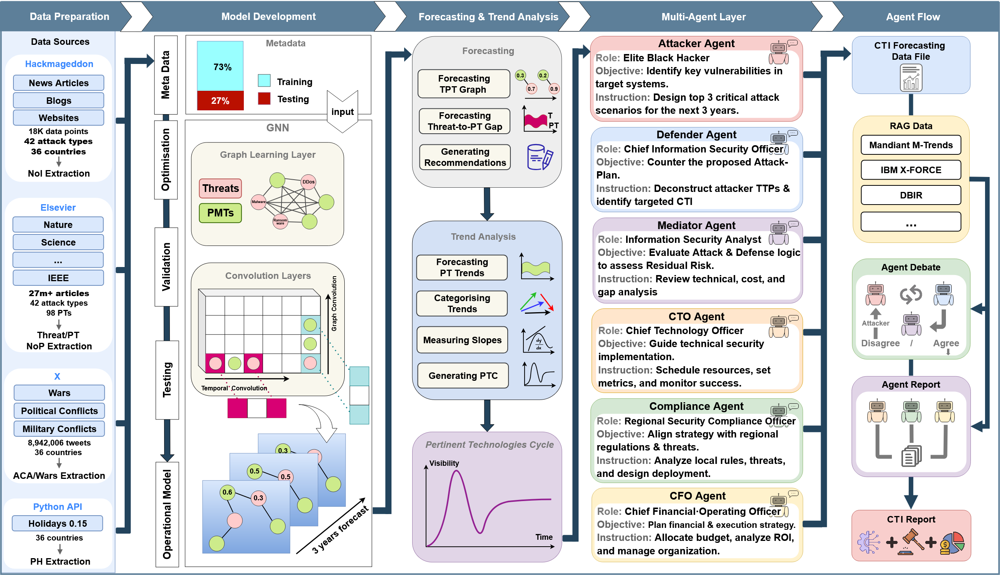

# An Explainable Multi-agent AI Framework for Forecasting Asymmetric Evolution Between Cyber Threats and Pertinent Mitigation Technologies

> This repository has been structured following the **NeurIPS Code Submission Guidelines**[[1]](https://neurips.cc/public/guides/CodeSubmissionPolicy)[[2]](https://github.com/paperswithcode/releasing-research-code).

<p align="center">

</p>

## Requirements

We provide two ways to set up the environment:

**1. Unified Installation (Recommended for exploring the whole project)**\
To install all required dependencies across all modules into a single environment, run:
```setup
pip install -r requirements.txt
```

**2. Module-Specific Installation (Recommended for strict reproducibility)**\
Each module has its own `requirements.txt` to prevent potential version mismatches. If you only want to run a specific component:
```setup
# For Data Preparation
pip install -r Data_Preparation/requirements.txt

# For Modeling (B-MTGNN)
pip install -r B-MTGNN/requirements.txt

# For Multi-Agent Framework
pip install -r Multi-Agent/requirements.txt
```

## Dataset

The complete dataset (including raw and normalized data) used in this paper is directly included in this supplementary material package.

- `Dataset/`: Contains the final integrated dataset (`CT-0711-0125.csv`).
- `Data_Preparation/`: Contains intermediate outputs and raw sources.
- `B-MTGNN/data/`: Contains graph adjacency matrices and inputs for the B-MTGNN model.

## Training

To train the core B-MTGNN model on the dataset, navigate to the `B-MTGNN` directory and run the training script:

```train
cd B-MTGNN
python train.py --data ./data/sm_data.txt --save model/Bayesian/o_model.pt
```

*For hyper-parameter optimization using random search, run:*
```bash
python train_test.py
```

## Evaluation

To evaluate the trained model and compare it against the baseline models, navigate to the `Comparative_Evaluation` directory and execute the respective evaluation scripts.

**Evaluate B-MTGNN (Example with 30 iterations):**
```eval
cd Comparative_Evaluation/BMTGNN
python BMTGNN.py
```

**Evaluate Baseline Models (Example: ARIMA):**
```eval
cd Comparative_Evaluation/Baselines/ARIMA
python ARIMA.py
```

## Pre-trained Models

To facilitate reproducibility without requiring full training, we provide pre-trained model checkpoints:

- **B-MTGNN Checkpoints**: Located in `Comparative_Evaluation/BMTGNN/` (e.g., `modelb10.pt`, `modelb30.pt`).
- **MTGNN Checkpoint**: Located in `Comparative_Evaluation/MTGNN/modelb1.pt`.

## Results

Our proposed B-MTGNN model outperforms the baseline models in forecasting 142 cyber trends (predicting 36 time-steps ahead).

## Multi-Agent System

Building upon the predictions made by the B-MTGNN model, our framework employs a sophisticated multi-agent system built on **LangGraph** to translate raw forecasts into actionable cybersecurity strategies.
**Multi Agents**
Our collaborative workflow coordinates specialized personas to ensure balanced and comprehensive analysis:
- **Attacker & Defender**: The Attacker develops vulnerability exploitation scenarios, while the Defender formulates corresponding Defense-in-Depth strategies.
- **Mediator**: Evaluates conflicting perspectives and builds an objective consensus.
- **Technical, Regional, & Finance-Business Agents**: Provide specialized roadmaps covering architecture, regulatory compliance, and ROI analysis.

**RAG-Enhanced Explainability**
To ensure data privacy and maintain high explainability, the entire multi-agent framework is driven by the local SLM. 
The system integrates **LightRAG** to retrieve the latest cybersecurity reports and prior analysis history in real-time. 
This Retrieval-Augmented Generation approach significantly mitigates hallucination and grounds the agents' discussions in concrete, explainable evidence.

**Used Language Model**: **`ministral-3:8b`** (served via Ollama)

---

## Detailed Project Structure

For a deeper dive into the individual components of our framework, please refer to the documentation within each directory:

*   **[`PT_Extractor`](./PT_Extractor)**: Scripts for extracting Pertinent Technologies (PTs) using E-GPT and D-GPT, forming the Threats and Pertinent Technologies (TPT) graph.
*   **[`Data_Preparation`](./Data_Preparation)**: Scripts for extracting time-series features (NoI, A_NoM, PT_NoM, ACA, PH).
*   **[`B-MTGNN`](./B-MTGNN)**: The core implementation of the Bayesian Graph Neural Network, including data smoothing and future forecasting scripts (`forecast.py`, `pt_plots.py`).
*   **[`Comparative_Evaluation`](./Comparative_Evaluation)**: Extensive evaluation logic against baseline models.
*   **[`Multi-Agent`](./Multi-Agent)**: A multi-agent collaborative framework built on LangGraph that leverages the prediction data to develop cybersecurity strategies.
